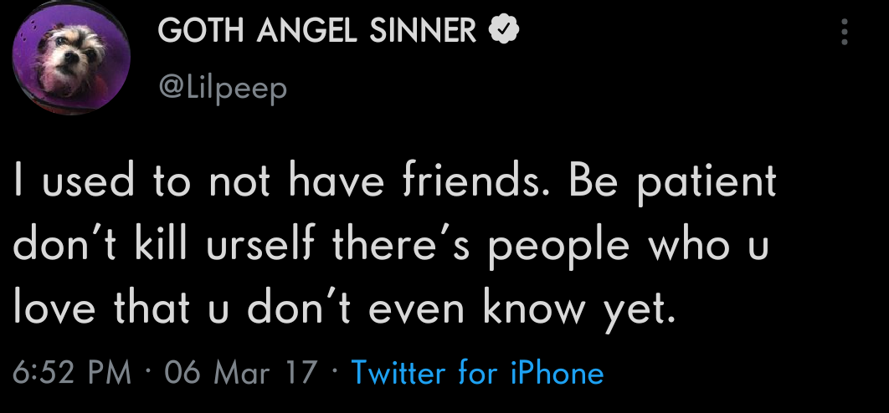

<h1 align="center">Ｗｅｌｃｏｍｅ</h1> 

---------------------------------------------------------------------------------------------------------------------------------------------------------------------------------

---------------------------------------------------------------------------------------------------------------------------------------------------------------------------------

  Visitor Count 
  

---------------------------------------------------------------------------------------------------------------------------------------------------------------------------------
<h2 align="center" style="font-size: 24px">~ 📻 Good Song Dawg 📻 ~</h2>
 

 
 

<!--
**LudovicoSforza/LudovicoSforza** is a ✨ _special_ ✨ repository because its `README.md` (this file) appears on your GitHub profile.

Here are some ideas to get you started:

- 🔭 I’m currently working on ...
- 🌱 I’m currently learning ...
- 👯 I’m looking to collaborate on ...
- 🤔 I’m looking for help with ...
- 💬 Ask me about ...
- 📫 How to reach me: ...
- 😄 Pronouns: ...
- ⚡ Fun fact: ...
-->
